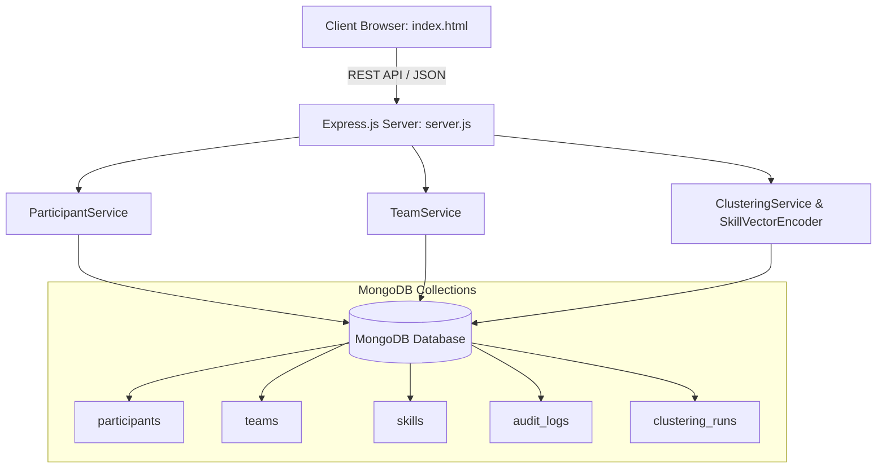

# 🚀 TeamWeave - Intelligent Hackathon Team Matcher

[](https://nodejs.org/)
[](https://www.mongodb.com/)
[](https://expressjs.com/)
[](https://mongoosejs.com/)
[](LICENSE)

**TeamWeave** is an algorithmic team formation and recruitment portal built for hackathons, design sprints, and academic competitions. It eliminates unbalanced teams by converting participant skills into **normalized multidimensional skill vectors**, applying **K-Means clustering** and **diversity balancing**, and persisting all data securely into **MongoDB**.

---

## 📑 Table of Contents
- [Key Features](#-key-features)
- [System Architecture](#-system-architecture)
- [Database Schema (MongoDB)](#-database-schema-mongodb)
- [REST API Reference](#-rest-api-reference)
- [Quick Start & Setup](#-quick-start--setup)
- [Configuration (.env)](#-configuration-env)
- [Running Automated Tests](#-running-automated-tests)
- [Project Directory Structure](#-project-directory-structure)

---

## 🌟 Key Features

* **🧮 Skill-Vector Encoding Engine**: Converts participant skill sets and ratings (1–5 scale) into normalized numerical vectors ($[0.0, 1.0]$) across Frontend, Backend, Data, Design, and DevOps disciplines.
* **⚡ K-Means Clustering Algorithm**: Automatically groups participants into balanced, cross-functional teams with centroid convergence detection.
* **🍃 Full MongoDB Persistence**: Built with Mongoose models, supporting local MongoDB, remote MongoDB Atlas clusters, or automatic zero-configuration in-memory fallback.
* **🔒 Team Locking & Member Rebalancing**: Organizers can lock finalized teams or transfer participants between teams with instantaneous validation.
* **📜 Complete Audit Trail**: Automatically tracks and timestamps all administrative events, transfers, and lock state modifications.
* **📊 Analytics Dashboard & CSV Exports**: Live statistics on participants and team distributions with one-click CSV export functionality.
* **💻 Interactive Web Portal**: Responsive UI with real-time statistics, registration forms, clustering modals, and team management views.

---

## 🏗️ System Architecture



---

## 🗄️ Database Schema (MongoDB)

### 1. `participants` Collection
Stores participant profiles and embedded skill proficiencies:
```json
{
  "_id": ObjectId("66ce00000000000000000001"),
  "name": "Alice Johnson",
  "email": "alice@example.com",
  "profileStatus": "Submitted",
  "skills": [
    { "skillName": "React", "category": "Frontend", "proficiencyLevel": 5 },
    { "skillName": "JavaScript", "category": "Frontend", "proficiencyLevel": 4 }
  ],
  "interests": ["Web Applications", "UI/UX"],
  "createdAt": ISODate("2026-08-29T10:00:00Z"),
  "updatedAt": ISODate("2026-08-29T10:00:00Z")
}
```

### 2. `teams` Collection
Stores generated teams, lock states, and embedded roster:
```json
{
  "_id": ObjectId("66ce00000000000000000010"),
  "name": "Team 1",
  "eventId": 1,
  "status": "Draft",
  "isLocked": false,
  "members": [
    {
      "participantId": ObjectId("66ce00000000000000000001"),
      "name": "Alice Johnson",
      "email": "alice@example.com",
      "skills": [...],
      "isLocked": false,
      "addedAt": ISODate("2026-08-29T10:05:00Z")
    }
  ],
  "createdAt": ISODate("2026-08-29T10:05:00Z")
}
```

### 3. `audit_logs` Collection
Audit logging for change tracking:
```json
{
  "_id": ObjectId("66ce00000000000000000030"),
  "changeType": "ParticipantMoved",
  "actor": "Organizer",
  "oldValue": "Team 1",
  "newValue": "Team 2",
  "details": "Moved 'Alice Johnson' from 'Team 1' to 'Team 2'",
  "timestamp": ISODate("2026-08-29T10:15:00Z")
}
```

### 4. `clustering_runs` Collection
Stores algorithm execution logs:
```json
{
  "_id": ObjectId("66ce00000000000000000040"),
  "eventId": 1,
  "teamsGenerated": 2,
  "parameters": { "targetTeamSize": 4, "algorithm": "KMeans_SkillVector" },
  "teamIds": [ObjectId("..."), ObjectId("...")],
  "status": "Completed",
  "durationMs": 8,
  "executedAt": ISODate("2026-08-29T10:05:00Z")
}
```

---

## 🔌 REST API Reference

| Method | Endpoint | Description |
| :--- | :--- | :--- |
| `GET` | `/api/health` | Service health status |
| `GET` | `/api/stats` | Dashboard metrics (participants count, teams count, avg size) |
| `GET` | `/api/skills` | Fetch all 24 skills in the catalog |
| `GET` | `/api/participants` | List participants (supports `?category=Frontend`, etc.) |
| `POST` | `/api/participants` | Register a new participant and log to `audit_logs` |
| `GET` | `/api/teams` | List all teams with their members |
| `POST` | `/api/clustering/run` | Execute K-Means clustering & persist teams to MongoDB |
| `POST` | `/api/teams/move` | Move a member between teams & log audit trail |
| `PATCH` | `/api/teams/:id/lock` | Lock or unlock a team |
| `GET` | `/api/audit-logs` | Retrieve chronological audit trail |
| `GET` | `/api/export/:type` | Download CSV for `participants`, `teams`, or `audit` |

---

## ⚡ Quick Start & Setup

### Prerequisites
* [Node.js](https://nodejs.org/) (v18 or higher)
* *(Optional)* [MongoDB Community Server](https://www.mongodb.com/try/download/community) or a free [MongoDB Atlas](https://www.mongodb.com/atlas) cluster. If MongoDB is not installed locally, the server automatically starts an in-memory MongoDB instance.

### 1. Clone & Install Dependencies
```bash
git clone https://github.com/your-username/TeamWeave.git
cd TeamWeave
npm install
```

### 2. Configure Environment (Optional)
Copy `.env.example` to `.env` and set your MongoDB URI:
```bash
cp .env.example .env
```
*(Leave blank to use the built-in development database)*

### 3. Start the Server
```bash
npm start
```
For development with auto-reloading:
```bash
npm run dev
```

### 4. Open in Browser
Visit **[http://localhost:3000](http://localhost:3000)** in your browser!

---

## 🧪 Running Automated Tests

TeamWeave includes an end-to-end integration test suite verifying MongoDB connections, participant registration, K-Means clustering, member rebalancing, team locking, and audit trail generation:

```bash
npm run test:db
```

**Expected Test Output:**
```
🧪 Starting TeamWeave MongoDB Integration Tests...
✅ Loaded 6 participants from MongoDB.
✅ Registered participant 'Grace Hopper' in MongoDB.
✅ Clustering completed! Created 2 teams.
✅ Recorded 1 ClusteringRun documents in MongoDB.
✅ Moved member successfully in MongoDB.
✅ Team 'Team 1' isLocked=true, status='Locked'.
✅ Retrieved 10 audit log entries from MongoDB.
✅ CSV generated successfully.

🎉 ALL MONGODB INTEGRATION TESTS PASSED SUCCESSFULLY! 🎉
```

---

## 📁 Project Directory Structure

```
TeamWeave/
├── config/
│   └── db.js                  # MongoDB connection & memory-server fallback
├── models/
│   ├── Participant.js         # Participant schema with embedded skills
│   ├── Team.js                # Team schema with member rosters
│   ├── Skill.js               # Technology catalog schema
│   ├── AuditLog.js            # Audit trail schema
│   └── ClusteringRun.js       # Algorithm execution history schema
├── services/
│   ├── SkillVectorEncoder.js  # Vector math, Euclidean & Cosine calculations
│   ├── ClusteringService.js   # K-Means clustering engine
│   ├── ParticipantService.js  # Participant operations & MongoDB queries
│   └── TeamService.js         # Team locking, member moves & CSV exports
├── scripts/
│   ├── seed.js                # Database seeder (24 skills & 6 demo participants)
│   └── testDb.js              # Automated integration test runner
├── server.js                  # Express API server
├── index.html                 # Frontend portal connected to MongoDB REST API
├── package.json               # Project manifest and scripts
├── .env / .env.example        # Environment variables configuration
└── README.md                  # Project documentation
```

---

## 📄 License
This project is open-source under the [MIT License](LICENSE).
